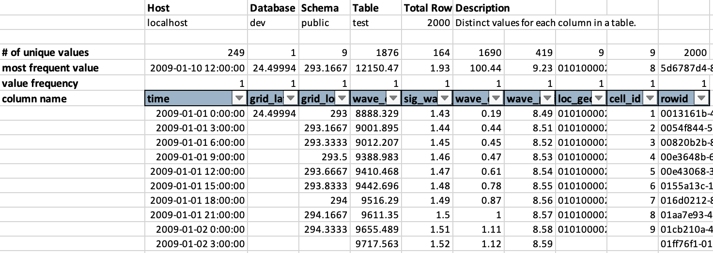

# tbl-summary.py

Summarize a PostgreSQL table by unique values and their frequency.

## Usage

```sh
usage: tbl-summary.py [-h] [-v HOST] [-d DATABASE] [-s SCHEMA] [-u USER] [-t TABLE] output_file

Create a summary of unique values for each column in a Postgres table. Summarize results in an Excel workbook. Version 0.0.2, 2023-02-14

positional arguments:
  output_file           Name of the XLSX output file

options:
  -h, --help            show this help message and exit
  -v HOST, --host HOST  Server hostname.
  -d DATABASE, --database DATABASE
                        Database name.
  -s SCHEMA, --schema SCHEMA
                        Database schema.
  -u USER, --username USER
                        Database username.
  -t TABLE, --table TABLE
                        Table name to summarize.
```

## Output


